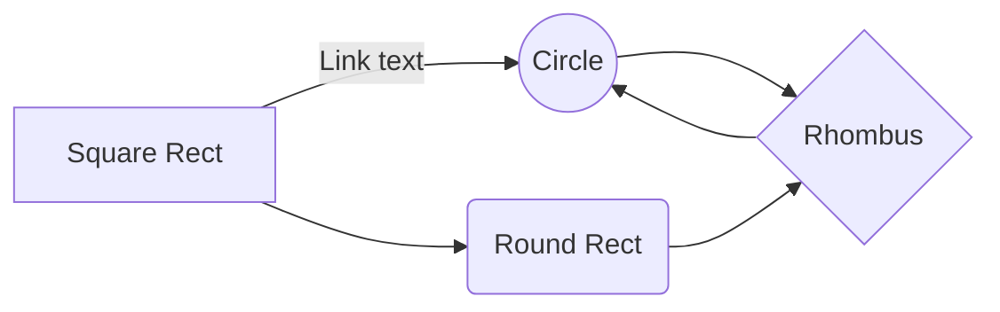
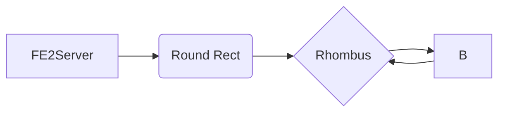

# AlarmsoftwareDoku

## Übersicht

|------|---|
|🏠|[Home](README.md)|
|ℹ️|[Stichwörter](Stichwörter.md)|
|🎨|[Farben](Farben.md)|

```mermaid
graph LR
A[Square Rect] -- Link text --> B((Circle))
A --> C(Round Rect)
B --> D{Rhombus}
C --> D
D --> B
```

```mermaid
graph LR
FE2Server --> C(Round Rect)
B --> D{Rhombus}
C --> D
D --> B
```