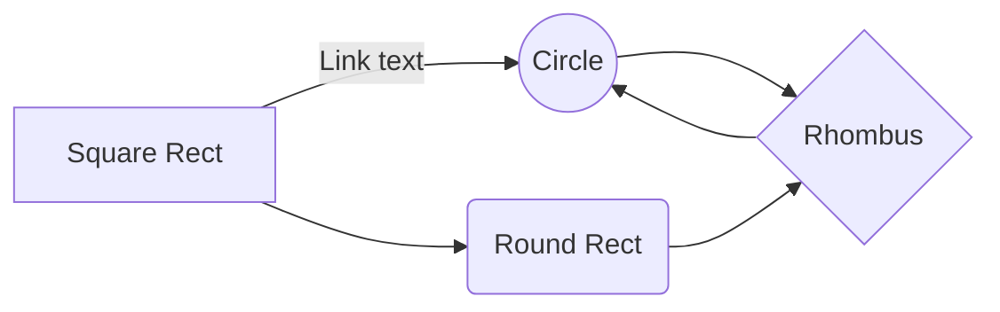
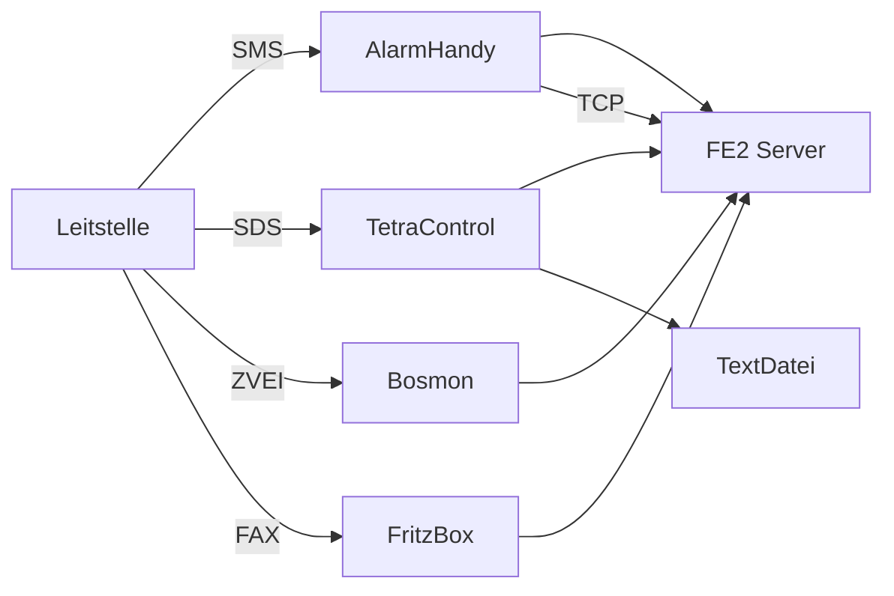

# AlarmsoftwareDoku

## Übersicht

|Icon|Name|
|------|---|
|🏠| [Home](README.md) |
|ℹ️| [Stichwörter](Stichwörter.md) |
|🎨| [Farben](Farben.md) |

```mermaid
graph LR
A[Square Rect] -- Link text --> B((Circle))
A --> C(Round Rect)
B --> D{Rhombus}
C --> D
D --> B
```

```mermaid
graph LR
Leitstelle -- SMS --> AlarmHandy
Leitstelle -- SDS --> TetraControl
Leitstelle -- ZVEI --> Bosmon
Leitstelle -- FAX --> FritzBox
Bosmon --> FE2Server
TetraControl --> FE2Server
TetraControl --> TextDatei
AlarmHandy --> FE2Server
FritzBox --> FE2Server
AlarmHandy -- TCP --> FE2Server[FE2 Server]

```