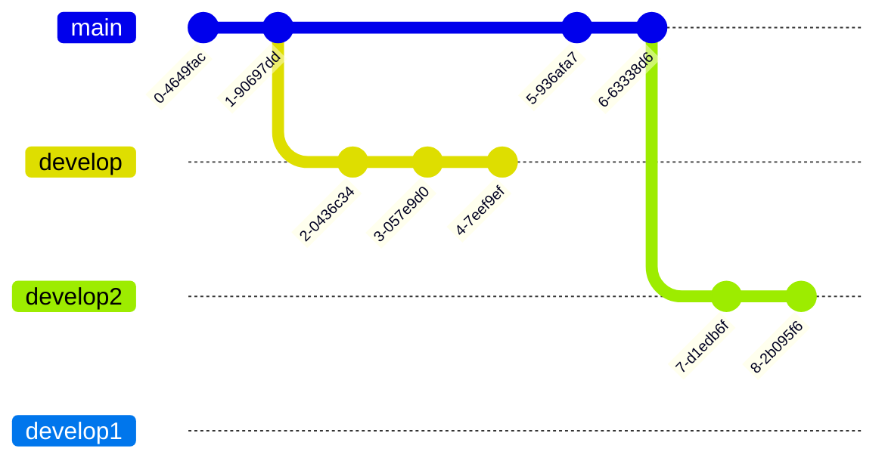

# AlarmsoftwareDoku

## Übersicht

|Icon|Name|
|------|---|
|🏠| [Home](README.md) |
|ℹ️| [Stichwörter](Stichwörter.md) |
|🎨| [Farben](Farben.md) |


## Vereinfachte Übersicht der Alarmfunktion der Feuerwehr Eichenbühl

### Alarmempfang


```mermaid
graph LR
Leitstelle[ILS Bayrischer Untermain]
AlarmHandy1[FW AlarmHandy Serverraum]
AlarmHandy2[FW Eichenbühl SMS Con]
Bosmon1[Bosmon Server 1]
Bosmon2[Bosmon Server 2]
Bosmon3[Bosmon Server 3]
FE2Server1[FE2 Server Master]
FE2Server2[FE2 Server Slave]
TetraControl1[TetraControl Server 1]
TetraControl2[TetraControl Server 2]

FahrzeugStatusänderung[Fahrzeugstatus Änderung AlarmMonitor und APager Info Alarm an KDT]
FahrzeugStatusänderung2[Info Alarm an KDT]

BosmonPrüfungSchleife[# Überprüfung der Schleife]
FE2SMSI[FE2 SMS Eingang]
FE2BosmonI[FE2 Eingang Bosmon]
FE2Tetra[FE2 Eingang SDS & Fahrzeug Status]
FE2FAX[FE2 Eingang Fax]
NotUsed[Aktuell nicht Verwendet]


a(# SMS von einer der beiden Nummern der ILS)
b(# Fax von einer der 5 Nummern der ILS )
c(# Prüfung SDS oder Status)
d(# Prüfung ob Fahrzeug bekannt ist)
e(# Enthält Keywords)

Leitstelle -- Fax Datei --> FAX --> b --> FE2FAX --> NotUsed

Leitstelle -- AlarmSMS --> AlarmHandy1	--> a -- Zutreffend --> FE2Server1
Leitstelle -- AlarmSMS --> AlarmHandy2	--> a -- Zutreffend --> FE2Server2

FE2Server1 --> FE2SMSI
FE2Server2 --> FE2SMSI

Leitstelle -- 466GU --> Bosmon1 --> BosmonPrüfungSchleife -- Zutreffend --> FE2BosmonI
Leitstelle -- 466GU --> Bosmon2 --> BosmonPrüfungSchleife 
Leitstelle -- 466GU --> Bosmon3 --> BosmonPrüfungSchleife

Leitstelle -- AlarmSDS oder Status --> TetraControl1 --> FE2Tetra
Leitstelle -- AlarmSDS oder Status --> TetraControl2 --> FE2Tetra

FE2Tetra --> c
c -- SDS --> TextDatei
c -- SDS --> AlarmAblauf
c -- Status --> d -- Zutreffend --> FahrzeugStatusänderung
d -- Nicht Zutreffend --> e -- Zutreffend --> FahrzeugStatusänderung2


```



